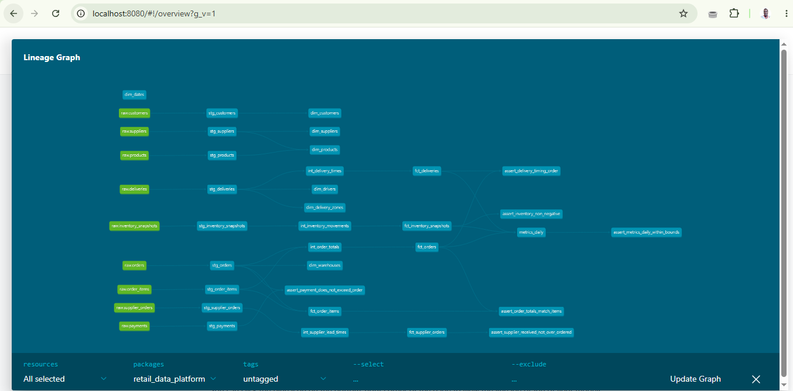

# Retail Data Platform

An end-to-end analytics engineering platform for an online supermarket. Ingests
raw operational data, models it into a trusted star schema in BigQuery, defines
core metrics once, and serves them to BI tools and AI assistants.

## Architecture

    raw (CSV) -> staging (views) -> intermediate (views) -> marts (tables)
                                                              |-- dimensions
                                                              |-- facts
                                                              |-- metrics_daily

Lineage:

## Stack

- **Warehouse:** Google BigQuery
- **Transformation:** dbt Core with `dbt-bigquery`
- **Language:** SQL, Python
- **Environment:** `uv` for Python and dependency management
- **Version control:** Git, feature-branch workflow

## Datasets

| Dataset | Purpose |
|---|---|
| `raw` | Source CSVs loaded as-is |
| `staging` | Cleaned and typed source data |
| `intermediate` | Business logic reused by marts |
| `marts` | Star schema and metrics |

## Core Metrics

All metrics are defined once in `marts.metrics_daily`. See
[docs/metric_dictionary.md](docs/metric_dictionary.md) for definitions,
formulas, owners, and the change process.

## Data Quality

111 automated tests including:

- Primary and foreign key checks
- Custom business rules (order reconciliation, delivery timing, inventory bounds, payment limits)
- Metric bounds on `metrics_daily`

See [docs/data_quality_log.md](docs/data_quality_log.md) for incidents and fixes.

## Getting Started

1. Install `uv`, `gcloud`, and Python 3.12.
2. Set up a GCP project with datasets `raw`, `staging`, `intermediate`, `marts`.
3. Create a service account with BigQuery Data Editor and Job User roles.
4. Configure `~/.dbt/profiles.yml` with the service account key.
5. Generate synthetic data and load it from the repository root:

       uv run python data/scripts/generate_raw_data.py
       uv run python data/scripts/load_raw_to_bigquery.py

6. Build the whole warehouse:

       cd dbt
       uv run dbt build --full-refresh

7. Generate and view docs:

       uv run dbt docs generate
       uv run dbt docs serve

## Documentation

- [Metric Dictionary](docs/metric_dictionary.md)
- [Data Catalogue](docs/data_catalogue.md)
- [Runbook](docs/runbook.md)
- [Data Quality Log](docs/data_quality_log.md)

## Repository Layout

    RetailDataPlatform/
    ├── data/
    │   ├── raw/                 # CSVs (gitignored)
    │   └── scripts/             # generators and loaders
    ├── dbt/
    │   ├── macros/              # generate_schema_name
    │   ├── models/
    │   │   ├── staging/
    │   │   ├── intermediate/
    │   │   └── marts/
    │   └── tests/               # custom singular tests
    ├── docs/
    └── pyproject.toml